# Practicas de Launch X: Misión FrontEnd

## Practica 1 - Proyecto Abogabot

La mayoria de las actividades se hicieron en miro con el fin de tener todo agrupado en un solo documneto, la excepcion fue las pantallas de ui que se realizaron en figma

### Toma de requerimientos
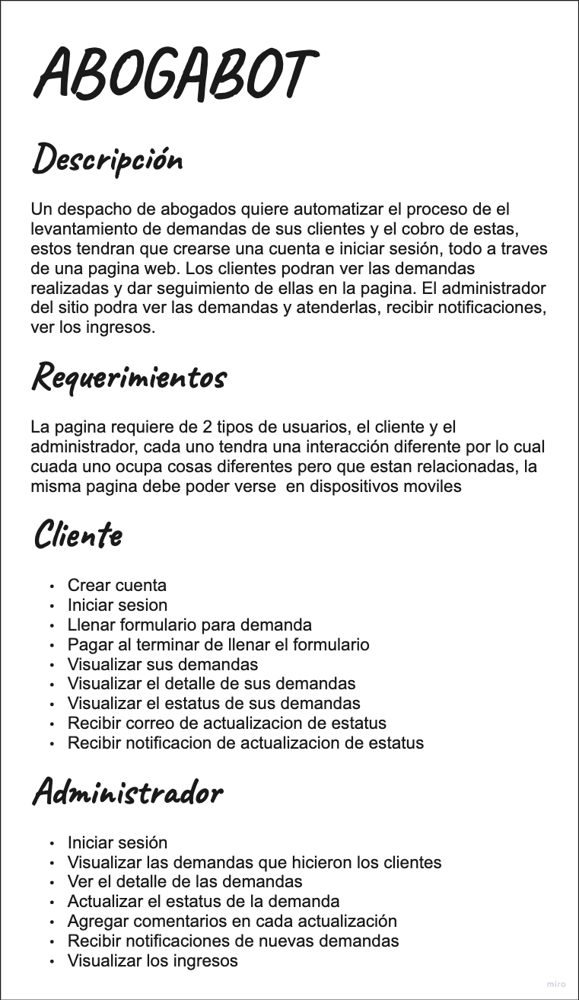

### Buyer persona
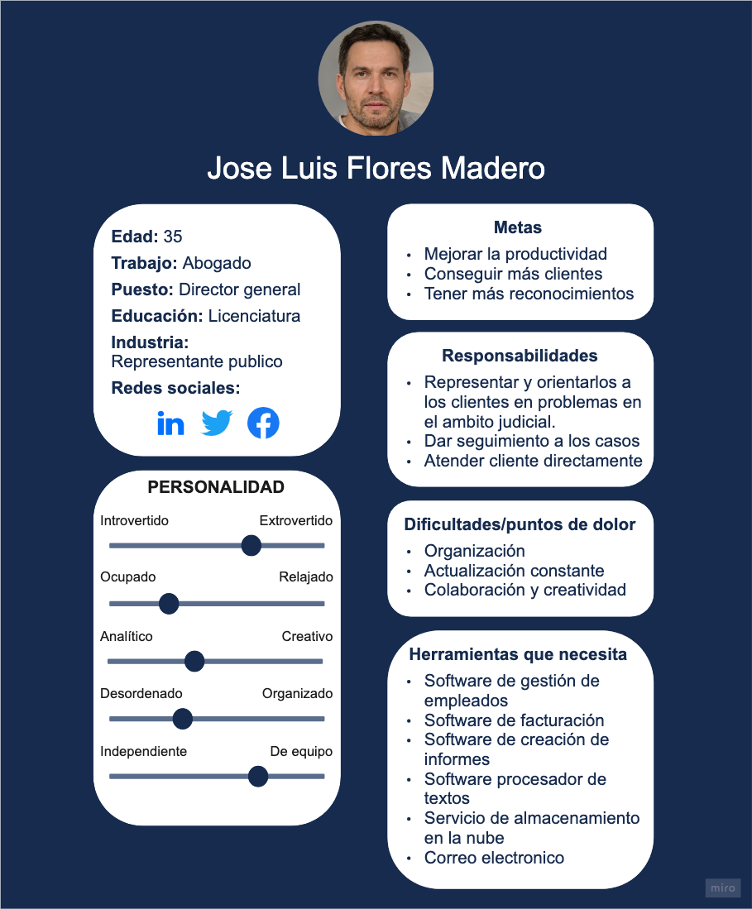

### Publico objetivo
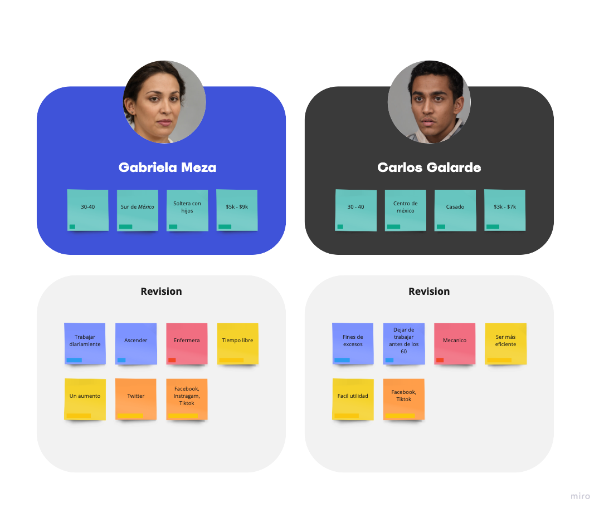

### Wirfeframes
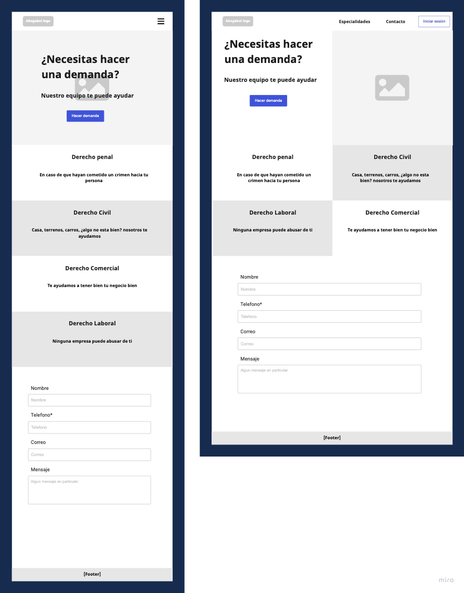
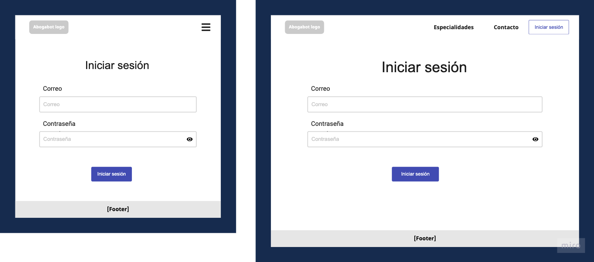
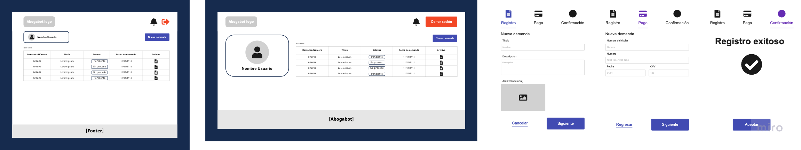
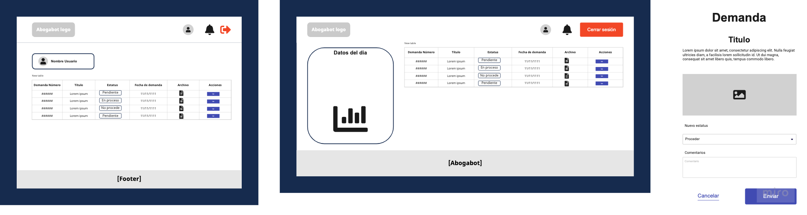

### UI
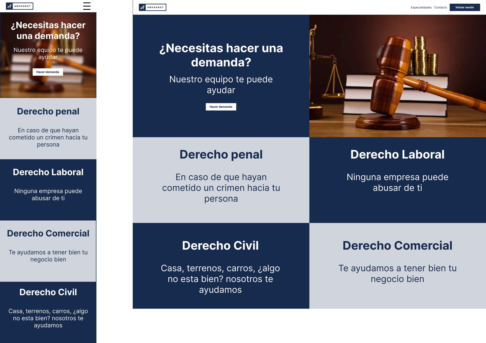
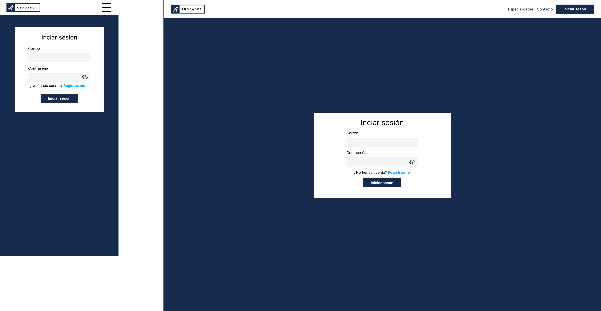
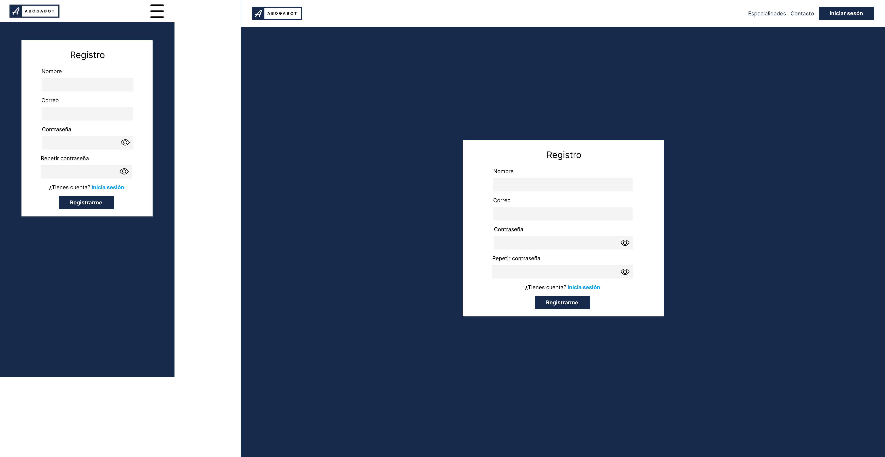
#### Cliente
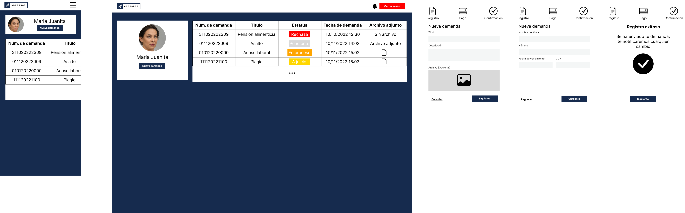
#### Administrador
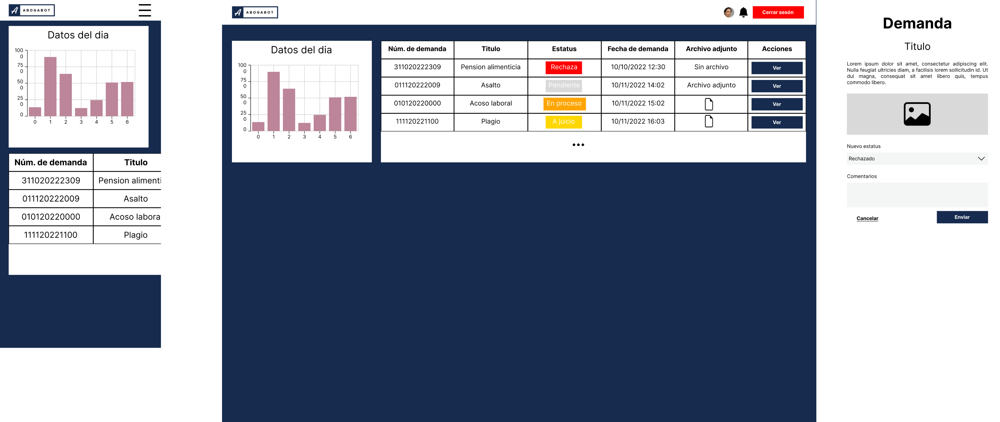